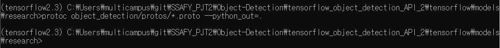

# Object Detection API(Tensorflow1 ver.)

## ⭐참고⭐

- 아나콘다 명령어

[파이썬 conda 및 pip 명령어](https://dowtech.tistory.com/14)

# 1. Anaconda 환경 구축

> 이름 : Object-Detection
python 버전 : 3.7.10

```powershell
conda create -n Object-Detection python=3.7
```

  

### 라이브러리 리스트

> **conda**(또는 pip) **install** **'라이브러리명'**(==버전)

```
numpy 1.18.5
tensorflow-gpu 1.15.5 [pip install tensorflow-gpu==1.14]
cython 0.29.22
git 2.23.0 [conda install git -y]
pycocotools 2.0 [pip install git+https://github.com/philferriere/cocoapi.git#subdirectory=PythonAPI]

// GPU를 사용하기 위해서 꼭 설치
CUDA toolkit : 10.0.130
CuDNN : 7.6.5
```

```powershell
// cuda toolkit
conda install cudatoolkit=10.0.130

//cudnn
conda install cudnn==7.6.5
```

- tensorflow 버전에 맞는 cudatoolkit, cudnn 버전 확인

[Build from source on Windows | TensorFlow](https://www.tensorflow.org/install/source_windows#tested_build_configurations)

- tensorflow 작동 확인하기

```powershell
python -c "import tensorflow as tf;print(tf.reduce_sum(tf.random.normal([1000, 1000])))"
```

  

# 2. Tensorflow Object Detection API 다운로드 및 컴파일하기

> API를 설치하고 가상환경에 적용시키는 단계

```powershell
[api를 저장할 경로]>
git clone https://github.com/tensorflow/models.git 
```

- Protobuf 설치 및 컴파일

Protobuf : Protocol Buffer라고 하는 직렬화 데이터구조를 띄는 것

⇒ 데이터 저장 방식을 변경함으로써 용량에서 이득을 볼 수 있다.

⇒ Tensorflow Object Detection API는 모델과 학습 파라미터들을 이러한 방식으로 구성했으므로 컴파일 역시 Protobuf 라이브러리로 진행해야 한다.

```
Protobuf 버전 : 3.14.0 (protoc-3.14.0-win64.zip 다운)  
```

  

- zip 파일 다운 경로

[Releases · protocolbuffers/protobuf](https://github.com/protocolbuffers/protobuf/releases)

- 압축 해제 후, proto.exe 파일이 존재하는 경로(~\bin)를 시스템 환경 변수에 추가
- protoc 사용 여부 확인(확인 경로 : ~\models\research)

```
protoc object_detection/protos/*.proto --python_out=.
```



protoc 컴파일 완료 화면  


# 3. COCO API 설치(Optional)

- Tensorflow 2.x 버전 Object Detection API를 설치할 때 pycocotools가 함께 설치되지만 다양한 이유로 버그가 생길 수 있다.
- 건너뛰어도 되지만 미리 설치할꺼면 이대로 하면 됨

```
[~\models\research]>
pip install cython //cython 설치
conda install git -y //git 설치
//pycocotools 설치
pip install git+https://github.com/philferriere/cocoapi.git#subdirectory=PythonAPI
```

  

**❗오류 이슈❗**

- pycocotools 설치 중 Microsoft Visual C++14.0 is required. 오류 발생

    ⇒ 아래의 홈페이지에서 **재배포 가능 패키지 및 빌드 도구 > Microsoft Build Tools 2015 업데이트 3** 다운로드 해서 기본값으로 설치

    [Visual Studio Older Downloads - 2017, 2015 & Previous Versions](https://visualstudio.microsoft.com/ko/vs/older-downloads/)  
    
    

# 4. Tensorflow Object Detection API 설치

- ~\models\research에 setup.py 파일 복사

```
[~\models\research]>
cp object_detection/packages/tf1/setup.py .
```

- 윈도우 anaconda에서는 cp 명령어가 실행되지 않을 수 있다.

    ⇒ **[models/research/object_detection/packages/tf1/]** 경로로 직접 들어가 setup.py 파일을 **[models/research]**에 복사

```
[~\models\research]>
python -m pip install .
```

  

**❗이슈❗**

- setup.py 를 설치했더니 numpy 버전이 1.19.5로 바뀌면서 충돌남

    ⇒ pip uninstall numpy 해주고 conda install numpy==1.18.5로 다시 설치

- tensorflow랑 tensorflow-gpu랑 같이 설치되어있으면 충돌난다던데 이건 코드 실행해보면서 확인해야할꺼 같음  

    

# 5. 1~4까지 설치 잘 됐는지 확인

```
[~models\research]>
python object_detection/builders/model_builder_tf1_test.py
```

- 위의 명령어 입력 시, 다음과 같이 출력되면 성공


  

# 6-1. Tensorflow Object Detection API tutorial 따라하기

**⭐공홈 따라하기⭐**

[TensorFlow 2 Object Detection API tutorial - TensorFlow 2 Object Detection API tutorial documentation](https://tensorflow-object-detection-api-tutorial.readthedocs.io/en/tensorflow-1.14/)

  

### 1. 필수 라이브러리 추가 설치

```jsx
opencv 3.4.2
pathlib 1.0.1
```

  

### 2. Tensorflow model 다운로드

- 기존의 git clone 명령어로 다운받으면 아마 최신버전으로 받아지는듯...?  


❗models-r1.13.0 다운 이슈❗

- git clone으로 다운받으면 다른 버전이 다운받아짐...

    ⇒ v.1.13.0 release github에서 .zip으로 다운받아서 ...\Tensor\ 폴더에 저장하고 폴더명 models로 변경하기!  
    
    

### 3. Protobuf 설치 및 컴파일

- 기존에 Protobuf는 다운받아서 환경변수까지 설정한 상태니까 컴파일만 실행

```powershell
[...\Tensorflow\models\research]>
protoc object_detection/protos/*.proto --python_out=.
pip install .
```

- research/slim 패스도 환경변수에 저장  

  

### 4. 설치 확인하기

```powershell
[...\Tensorflow\models\research\object_detection]>
jupyter notebook
```

- object_detection_tutorial.ipynb 파일 실행

- 모든 코드 실행하기  

  

**❗11번째 코드 오류 이슈❗**

- 11번째 코드 첫 번째 줄에 `%matplotlib inline` 추가하기


- 그래도 오류나면 CUDA, CuDNN 로컬 환경에 설치하기 `pick`

[Installation - TensorFlow 2 Object Detection API tutorial documentation](https://tensorflow-object-detection-api-tutorial.readthedocs.io/en/tensorflow-1.14/install.html#tensorflow-gpu)  


### 5. labelImg 이용해서 이미지 라벨링

- labelImg 설치

    ```powershell
    pip install labelImg
    ```

      

- 이미지 라벨링 처리

    ```powershell
    [...\Object-Detection]>
    labelImg ./images[라벨링 할 이미지가 있는 경로]/

    >> .xml 저장할 폴더 선택(Change Save Dir) 
    >> 라벨링 할 이미지 있는 폴더 선택(Open Dir) 
    >> 라벨링 처리

    1. w : 영역 잡기
    2. a : 이전 사진으로 이동
    3. d : 다음 사진으로 이동
    ```

  

### 6. 라벨 맵 생성하기

- workspace 폴더 생성

    ```powershell
    TensorFlow
    ├─ addons (option) -> 나는 생성 X (pip로 설치함)
    │   └─ labelImg
    ├─ models
    │   ├─ official
    │   ├─ research
    │   ├─ samples
    │   └─ tutorials
    └─ workspace `new!`
        └─ training_demo `new!`
    				├─ annotations : *.csv 또는 *.record 파일 저장하는 폴더
    				├─ images : test, train 이미지, .xml 데이터 저장하는 폴더
    				│   ├─ test
    				│   └─ train
    				├─ pre-trained-model : 선택한 사전 훈련 된 모델이 포함되며 훈련 작업의 시작 체크 포인트로 사용
    				├─ training : 학습 모델 및 학습 파이프 라인 구성 파일 저장
    				└─ README.md : 학습 기록 남기기용
    ```

      

- 이미지 분할하기(train, test 데이터 나누기)

    [Training Custom Object Detector - TensorFlow 2 Object Detection API tutorial documentation](https://tensorflow-object-detection-api-tutorial.readthedocs.io/en/tensorflow-1.14/training.html)

    ```python
    """ usage: partition_dataset.py [-h] [-i IMAGEDIR] [-o OUTPUTDIR] [-r RATIO] [-x]
    
    Partition dataset of images into training and testing sets
    
    optional arguments:
      -h, --help            show this help message and exit
      -i IMAGEDIR, --imageDir IMAGEDIR
                            Path to the folder where the image dataset is stored. If not specified, the CWD will be used.
      -o OUTPUTDIR, --outputDir OUTPUTDIR
                            Path to the output folder where the train and test dirs should be created. Defaults to the same directory as IMAGEDIR.
      -r RATIO, --ratio RATIO
                            The ratio of the number of test images over the total number of images. The default is 0.1.
      -x, --xml             Set this flag if you want the xml annotation files to be processed and copied over.
    """
    import os
    import re
    import shutil
    from PIL import Image
    from shutil import copyfile
    import argparse
    import glob
    import math
    import random
    import xml.etree.ElementTree as ET
    
    def iterate_dir(source, dest, ratio, copy_xml):
        source = source.replace('\\', '/')
        dest = dest.replace('\\', '/')
        train_dir = os.path.join(dest, 'train')
        test_dir = os.path.join(dest, 'test')
    
        if not os.path.exists(train_dir):
            os.makedirs(train_dir)
        if not os.path.exists(test_dir):
            os.makedirs(test_dir)
    
        images = [f for f in os.listdir(source)
                  if re.search(r'([a-zA-Z0-9\s_\\.\-\(\):])+(.jpg|.jpeg|.png)$', f)]
    
        num_images = len(images)
        num_test_images = math.ceil(ratio*num_images)
    
        for i in range(num_test_images):
            idx = random.randint(0, len(images)-1)
            filename = images[idx]
            copyfile(os.path.join(source, filename),
                     os.path.join(test_dir, filename))
            if copy_xml:
                xml_filename = os.path.splitext(filename)[0]+'.xml'
                copyfile(os.path.join(source, xml_filename),
                         os.path.join(test_dir,xml_filename))
            images.remove(images[idx])
    
        for filename in images:
            copyfile(os.path.join(source, filename),
                     os.path.join(train_dir, filename))
            if copy_xml:
                xml_filename = os.path.splitext(filename)[0]+'.xml'
                copyfile(os.path.join(source, xml_filename),
                         os.path.join(train_dir, xml_filename))
    
    def main():
    
        # Initiate argument parser
        parser = argparse.ArgumentParser(description="Partition dataset of images into training and testing sets",
                                         formatter_class=argparse.RawTextHelpFormatter)
        parser.add_argument(
            '-i', '--imageDir',
            help='Path to the folder where the image dataset is stored. If not specified, the CWD will be used.',
            type=str,
            default=os.getcwd()
        )
        parser.add_argument(
            '-o', '--outputDir',
            help='Path to the output folder where the train and test dirs should be created. '
                 'Defaults to the same directory as IMAGEDIR.',
            type=str,
            default=None
        )
        parser.add_argument(
            '-r', '--ratio',
            help='The ratio of the number of test images over the total number of images. The default is 0.1.',
            default=0.1,
            type=float)
        parser.add_argument(
            '-x', '--xml',
            help='Set this flag if you want the xml annotation files to be processed and copied over.',
            action='store_true'
        )
        args = parser.parse_args()
    
        if args.outputDir is None:
            args.outputDir = args.imageDir
    
        # Now we are ready to start the iteration
        iterate_dir(args.imageDir, args.outputDir, args.ratio, args.xml)
    
    if __name__ == '__main__':
        main()
    ```

    - 해당 코드를 `partition_dataset.py` 파일로 생성하고, training_damo\images 안에 있는 이미지 파일과 .xml파일을 train, test 폴더로 나눔 (90%, 10% 비율)

        ```powershell
        [..\workspace\training_demo]>
        python partition_dataset.py -x -i ./images -r 0.1
        ```

      

- 라벨 맵 생성(.pbtxt 파일 생성) ⇒ `training_demo\annotations` 폴더 안에 `label_map.pbtxt` 생성

    ```powershell
    item {
        id: 1
        name: 'avante2020'
    }

    item {
        id: 2
        name: 'granduer2020'
    }

    item {
        id: 3
        name: 'sonata2020'
    }

    .
    .
    .
    ```

  

### 7. TensorFlow Record 만들기

- scripts 폴더 생성

    ```powershell
    TensorFlow
    ├─ addons
    │   └─ labelImg
    ├─ models
    │   ├─ official
    │   ├─ research
    │   ├─ samples
    │   └─ tutorials
    ├─ scripts `new!`
    │   └─ preprocessing `new!`
    └─ workspace
        └─ training_demo
    ```

      

- pandas 설치

    ```powershell
    conda install pandas
    ```

      

- `.xml` 파일로 `.csv` 파일 만들기

    ```powershell
    """
    Usage:
    # Create train data:
    python xml_to_csv.py -i [PATH_TO_IMAGES_FOLDER]/train -o [PATH_TO_ANNOTATIONS_FOLDER]/train_labels.csv
    
    # Create test data:
    python xml_to_csv.py -i [PATH_TO_IMAGES_FOLDER]/test -o [PATH_TO_ANNOTATIONS_FOLDER]/test_labels.csv
    """
    
    import os
    import glob
    import pandas as pd
    import argparse
    import xml.etree.ElementTree as ET
    
    def xml_to_csv(path):
        """Iterates through all .xml files (generated by labelImg) in a given directory and combines them in a single Pandas datagrame.
    
        Parameters:
        ----------
        path : {str}
            The path containing the .xml files
        Returns
        -------
        Pandas DataFrame
            The produced dataframe
        """
    
        xml_list = []
        for xml_file in glob.glob(path + '/*.xml'):
            tree = ET.parse(xml_file)
            root = tree.getroot()
            for member in root.findall('object'):
                value = (root.find('filename').text,
                        int(root.find('size')[0].text),
                        int(root.find('size')[1].text),
                        member[0].text,
                        int(member[4][0].text),
                        int(member[4][1].text),
                        int(member[4][2].text),
                        int(member[4][3].text)
                        )
                xml_list.append(value)
        column_name = ['filename', 'width', 'height',
                    'class', 'xmin', 'ymin', 'xmax', 'ymax']
        xml_df = pd.DataFrame(xml_list, columns=column_name)
        return xml_df
    
    def main():
        # Initiate argument parser
        parser = argparse.ArgumentParser(
            description="Sample TensorFlow XML-to-CSV converter")
        parser.add_argument("-i",
                            "--inputDir",
                            help="Path to the folder where the input .xml files are stored",
                            type=str)
        parser.add_argument("-o",
                            "--outputFile",
                            help="Name of output .csv file (including path)", type=str)
        args = parser.parse_args()
    
        if(args.inputDir is None):
            args.inputDir = os.getcwd()
        if(args.outputFile is None):
            args.outputFile = args.inputDir + "/labels.csv"
    
        assert(os.path.isdir(args.inputDir))
    
        xml_df = xml_to_csv(args.inputDir)
        xml_df.to_csv(
            args.outputFile, index=None)
        print('Successfully converted xml to csv.')
    
    if __name__ == '__main__':
        main()
    ```

    - 해당 코드로 `scripts\preprocessing` 폴더에 `xml_to_csv.py` 파일 생성 >> csv 파일 생성

        ```powershell
        [..\scripts\preprocessing]>
        # train data.csv
        python xml_to_csv.py -i [..\training_demo\images]\train -o [..\training_demo\annotations]\train_labels.csv

        # test data.csv
        python xml_to_csv.py -i [..\training_demo\images]\test -o [..\training_demo\annotations]\test_labels.csv
        ```

      

- `.csv` 파일 `.record` 파일로 변환

    ```powershell
    """
    Usage:

    # Create train data:
    python generate_tfrecord.py --label=<LABEL> --csv_input=<PATH_TO_ANNOTATIONS_FOLDER>/train_labels.csv  --output_path=<PATH_TO_ANNOTATIONS_FOLDER>/train.record

    # Create test data:
    python generate_tfrecord.py --label=<LABEL> --csv_input=<PATH_TO_ANNOTATIONS_FOLDER>/test_labels.csv  --output_path=<PATH_TO_ANNOTATIONS_FOLDER>/test.record
    """

    from __future__ import division
    from __future__ import print_function
    from __future__ import absolute_import

    import os
    import io
    import pandas as pd
    import tensorflow as tf
    import sys
    sys.path.append("../../models/research")

    from PIL import Image
    from object_detection.utils import dataset_util
    from collections import namedtuple, OrderedDict

    flags = tf.app.flags
    flags.DEFINE_string('csv_input', '', 'Path to the CSV input')
    flags.DEFINE_string('output_path', '', 'Path to output TFRecord')
    flags.DEFINE_string('label', '', 'Name of class label')
    # if your image has more labels input them as
    # flags.DEFINE_string('label0', '', 'Name of class[0] label')
    # flags.DEFINE_string('label1', '', 'Name of class[1] label')
    # and so on.
    flags.DEFINE_string('img_path', '', 'Path to images')
    FLAGS = flags.FLAGS

    # TO-DO replace this with label map
    # for multiple labels add more else if statements
    def class_text_to_int(row_label):
        if row_label == FLAGS.label:  # 'ship':
            return 1
        # comment upper if statement and uncomment these statements for multiple labelling
        # if row_label == FLAGS.label0:
        #   return 1
        # elif row_label == FLAGS.label1:
        #   return 0
        else:
            None

    def split(df, group):
        data = namedtuple('data', ['filename', 'object'])
        gb = df.groupby(group)
        return [data(filename, gb.get_group(x)) for filename, x in zip(gb.groups.keys(), gb.groups)]

    def create_tf_example(group, path):
        with tf.gfile.GFile(os.path.join(path, '{}'.format(group.filename)), 'rb') as fid:
            encoded_jpg = fid.read()
        encoded_jpg_io = io.BytesIO(encoded_jpg)
        image = Image.open(encoded_jpg_io)
        width, height = image.size

        filename = group.filename.encode('utf8')
        image_format = b'jpg'
        # check if the image format is matching with your images.
        xmins = []
        xmaxs = []
        ymins = []
        ymaxs = []
        classes_text = []
        classes = []

        for index, row in group.object.iterrows():
            xmins.append(row['xmin'] / width)
            xmaxs.append(row['xmax'] / width)
            ymins.append(row['ymin'] / height)
            ymaxs.append(row['ymax'] / height)
            classes_text.append(row['class'].encode('utf8'))
            classes.append(class_text_to_int(row['class']))

        tf_example = tf.train.Example(features=tf.train.Features(feature={
            'image/height': dataset_util.int64_feature(height),
            'image/width': dataset_util.int64_feature(width),
            'image/filename': dataset_util.bytes_feature(filename),
            'image/source_id': dataset_util.bytes_feature(filename),
            'image/encoded': dataset_util.bytes_feature(encoded_jpg),
            'image/format': dataset_util.bytes_feature(image_format),
            'image/object/bbox/xmin': dataset_util.float_list_feature(xmins),
            'image/object/bbox/xmax': dataset_util.float_list_feature(xmaxs),
            'image/object/bbox/ymin': dataset_util.float_list_feature(ymins),
            'image/object/bbox/ymax': dataset_util.float_list_feature(ymaxs),
            'image/object/class/text': dataset_util.bytes_list_feature(classes_text),
            'image/object/class/label': dataset_util.int64_list_feature(classes),
        }))
        return tf_example

    def main(_):
        writer = tf.python_io.TFRecordWriter(FLAGS.output_path)
        path = os.path.join(os.getcwd(), FLAGS.img_path)
        examples = pd.read_csv(FLAGS.csv_input)
        grouped = split(examples, 'filename')
        for group in grouped:
            tf_example = create_tf_example(group, path)
            writer.write(tf_example.SerializeToString())

        writer.close()
        output_path = os.path.join(os.getcwd(), FLAGS.output_path)
        print('Successfully created the TFRecords: {}'.format(output_path))

    if __name__ == '__main__':
        tf.app.run()
    ```

    - 해당 코드로 `scripts\preprocessing` 폴더에 `generate_tfrecord.py` 파일 생성 >> record 파일로 변환

        ```powershell
        [..\scripts\preprocessing]>
        # Create train data:
        python generate_tfrecord.py --csv_input=[..\training_demo\annotations]/train_labels.csv
        --img_path=[..\training_demo\images]/train  --output_path=[..\training_demo\annotations]/train.record

        # Create test data:
        python generate_tfrecord.py --csv_input=[..\training_demo\annotations]/test_labels.csv
        --img_path=[..\training_demo\images]/test
        --output_path=[..\training_demo\annotations]/test.record
        ```

  

### 8. Learning Pipe-Line 구성하기

- 학습에 사용할 모델 골라서 다운로드 하기(ssd_inception_v2_coco 기준)

    [tensorflow/models](https://github.com/tensorflow/models/blob/master/research/object_detection/g3doc/tf1_detection_zoo.md)

    - 원하는 모델 선택해서 다운  

      

    **❗다운로드 이슈❗**

    - 모델명을 클릭해도 다운로드가 안됨 ⇒ 모델 명에 마우스오버 했을 때, 좌측 하단에 나오는 링크를 주소창에 직접 입력
    
    ```powershell
https://download.tensorflow.org/models/object_detection/[원하는 모델명].tar.gz
    ```

    - 다운받은 .tar.gz 파일을 `..\training_demo\pre-trained-model` 파일에 압축 해제
    
        ```powershell
        [..\training_demo\pre-trained-model]>
    tar -xzvf ssd_mobilenet_v1_coco.tar.gz
        ```

    - 모델.config 파일 다운받기 ⇒ `..\models\research\object_detection\samples\configs` 에서 원하는 모델의 .config 파일을 복사해서 `..\training_demo\training` 폴더에 붙여넣기

    - .config 파일 설정 변경
    
        ```powershell
        model {
            ssd {
                **num_classes: 1** # Set this to the number of different label classes
                box_coder {
                    faster_rcnn_box_coder {
                        y_scale: 10.0
                        x_scale: 10.0
                        height_scale: 5.0
                        width_scale: 5.0
                }
                }

                ...
    
                }
                feature_extractor {
                    **type: 'ssd_inception_v2'** # Set to the name of your chosen pre-trained model
                    min_depth: 16
                    depth_multiplier: 1.0
                    conv_hyperparams {
                        activation: RELU_6,
                        regularizer {
                            l2_regularizer {
                                weight: 0.00004
                            }
                        }
                        initializer {
                            truncated_normal_initializer {
                                stddev: 0.03
                                mean: 0.0
                            }
                        }
                        batch_norm {
                            train: true,
                            scale: true,
                            center: true,
                            decay: 0.9997,
                            epsilon: 0.001,
                        }
                    }
                    override_base_feature_extractor_hyperparams: true
                }
            
        			...
    
        }
        }
    
        train_config: {
            **batch_size: 12** # Increase/Decrease this value depending on the available memory (Higher values require more memory and vice-versa)
            optimizer {
                rms_prop_optimizer: {
                    learning_rate: {
                        exponential_decay_learning_rate {
                            initial_learning_rate: 0.004
                            decay_steps: 800720
                            decay_factor: 0.95
                        }
                    }
                    momentum_optimizer_value: 0.9
                    decay: 0.9
                    epsilon: 1.0
                }
            }
        **fine_tune_checkpoint: "pre-trained-model/model.ckpt"** # Path to extracted files of pre-trained model
            from_detection_checkpoint: true
    
            # Note: The below line limits the training process to 200K steps, which we
            # empirically found to be sufficient enough to train the pets dataset. This
        # effectively bypasses the learning rate schedule (the learning rate will
            # never decay). Remove the below line to train indefinitely.
    
            **num_steps: 200000** #학습 단계 설정(해당 단계만큼 학습 진행)
            data_augmentation_options {
                random_horizontal_flip {
                }
            }
            data_augmentation_options {
                ssd_random_crop {
                }
        }
        }
    
        train_input_reader: {
            tf_record_input_reader {
                **input_path: "annotations/train.record"** # Path to training TFRecord file
            }
        **label_map_path: "annotations/label_map.pbtxt"** # Path to label map file
        }
    
        eval_config: {
            # (Optional): Uncomment the line below if you installed the Coco evaluation tools
            # and you want to also run evaluation
            # metrics_set: "coco_detection_metrics"
            # (Optional): Set this to the number of images in your <PATH_TO_IMAGES_FOLDER>/train
            # if you want to also run evaluation
            num_examples: 8000
            # Note: The below line limits the evaluation process to 10 evaluations.
            # Remove the below line to evaluate indefinitely.
        max_evals: 10
        }
    
        eval_input_reader: {
            tf_record_input_reader {
                **input_path: "annotations/test.record"** # Path to testing TFRecord
            }
            **label_map_path: "annotations/label_map.pbtxt"** # Path to label map file
            shuffle: false
            num_readers: 1
    }
        ```

    - slim 패스 설정
    
        ```powershell
        >> set PYTHONPATH=[..\Tensorflow\models]
        >> set PYTHONPATH=[..\Tensorflow\models\research]
        >> set PYTHONPATH=[..\Tensorflow\models\research\slim]
        ```

  

### 9. Learning Train 하기

- `model_main.py` 복사 ⇒ `..\models\research\object_detection` 폴더에 있는 `model_main.py` 를 복사해서 `..\training_demo` 폴더에 붙여넣기

- 코드 실행시키기

    ```powershell
    [..\training_demo]>
    python model_main.py --alsologtostderr --train_dir=training/ --pipeline_config_path=training/ssd_inception_v2_coco.config
    ```

  

**❗이슈❗**

- TypeError 'numpy.float64' 가 나는 경우

    ⇒ 해당 튜토리얼 기준으로 numpy 버전은 1.16.4로 설치되어야 하는데 이 버전이 안맞아서 그럴 확률이 크다.

    ⇒ matplotlib를 설치하면 저절로 numpy가 상위 버전으로 설치되는데 이 때, matplotlib 먼저 설치하고 numpy를 1.16.4로 다시 설치하면 자동으로 다운그레이드 됨

    ⇒ 이 때, numpy를 pip로 설치했으면 pip uninstall numpy 해야됨  
    
    

### 10. Exporting a Trained Inference Graph

- `..\Tensorflow\models\research\object_detection` 폴더에서 `export_inference_graph.py` 파일을 복사해서 `..\training_demo` 폴더에 붙여넣기
- `..\training_demo\training` 에 생성된 `model.ckpt-*` 파일 중 가장 높은 step을 체크
- `export_inference_graph.py` 실행시키기

    ```powershell
    python export_inference_graph.py --input_type image_tensor --pipeline_config_path training/ssd_inception_v2_coco.config --trained_checkpoint_prefix training/model.ckpt-[최상위 단계] --output_directory trained-inference-graphs/output_inference_graph_v1.pb
    ```

  

### 11. Predict 해보기

- `..\training_demo\trained-inference-graphs\output_inference_graph_v1.pd` 폴더 : frozen_inference_graph.pb 파일
- `..\training_demo\annotations` 폴더 : label_map.pbtxt
- `..\training_demo\images` 폴더 : test 이미지  
=======
# Object-Detection 학습

## ⭐GITHUB⭐

[5taku/custom_object_detection](https://github.com/5taku/custom_object_detection/tree/a5921b3c020dddb542412e8c0f38a42e594b34ba#summary)

## Object Detection API 사용해서 따라하기

### 0. Tutorial

```
Object-Detection Folder
	└─ google-images-download //구글 이미지 크롤링
	└─ images //크롤링한 이미지 저장
	└─ labelImg //이미지 라벨링
	└─ models //tensorflow (아마도)2.0 models Folder
	└─ tensorflow_object_detection_helper_tool //object_detection model api
	└─ xml //라벨링 결과 저장
anaconda - Object-Detection
- python 3.7.10

lib
	- cudnn 7.6.5
	- Cython 0.29.22
	- jupyter 1.0.0
	- lxml 4.6.1
	- matplotlib 3.3.4
	- numpy 1.19.2
	- pandas 1.2.3
	- pillow 8.1.2
	- pyqt 5.9.2
	- scikit-learn 0.24.1
	- scipy 1.6.1
	- tensorflow 1.5.0	//2.x 버전 안됨(tensorflow.contrib.slim 문제)
	- tqdm 4.56.0
	- etc.
```

### 1. 데이터 수집

- Object-Detection / google-images-download 를 이용해서 데이터 수집하기

  (avante2020 정/측/후면 이미지 각각 100장씩 크롤링)

```powershell
...\\google-images-download> googleimagesdownload --keywords "avante2020 frontal" --size medium --output_directory ./images/
```

- 사진 확장자는 .jpg만 사용 가능(.png/.webp 파일 삭제)

- 적절한 이미지가 아닌 사진들 정제(아반떼 사진이 아닌 것, 측면 폴더에 있는 후면 사진 등)

### 2. 데이터 라벨링

- labelImg 이용하여 이미지에 라벨링 처리

```powershell
...\\labelImg> pyrcc5 -o libs/resources.py resources.qrc
...\\labelImg> python labelImg.py -i "../images/이미지 저장된 폴더명"
```

- Change Save dir ⇒ xml 파일 저장할 폴더 지정(보통 원본 이미지 파일하고 같은 폴더에 저장)

- Open Dir ⇒ 원본 이미지가 저장된 폴더 선택

- 원하는 영역을 선택한 뒤, 라벨링 처리

- 단축키

  - W : 영역 지정

  - A : 이전 이미지

  - D : 다음 이미지

### 3. label_map.pdtxt 파일 수정

- 본인이 지정한 라벨링에 맞춰서 파일 수정

**(PATH : ...\tensorflow_object_detection_helper_tool\label_map.pdtxt)**

```
item {
  id: 1
  name: 'avante2020 frontal'
}
item {
  id: 2
  name: 'avante2020 rear'
}
item {
  id: 3
  name: 'avante2020 side'
}
```

### 4. TF RECORD 파일 생성

- tensorflow_object_detection_helper_tool 이용해서 TF RECORD 파일을 생성

```powershell
...\\tensorflow_object_detection_helper_tool> python tfgenerator.py -i "../images/tfRecord"
```

### 5. Treansfer Learning & exporting

- import 경로 맞춰주기(이유는 모르겠는데 경로가 아주 그냥 엉망진창이야🤬)

- Raster_Rcnn_Inception_v2_coco 모델을 통해서 50000번 학습시키기

  (3000번 주기로 evaluate 값 확인)

**❗오류 이슈❗**

1. from deployment import model_deploy 가 어디 있는데....!!!!!!

   ⇒ tf_slim 따로 설치해서 해결!

   ```
   //cmd 켤 때마다 이거 두 줄 추가(걍 고정하는 법 없나...)
   set PYTHONPATH=C:\\Users\\multicampus\\git\\SSAFY_PJT2\\Object-Detection\\tensorflow\\models;C:\\Users\\multicampus\\git\\SSAFY_PJT2\\Object-Detection\\tensorflow\\models\\research;C:\\Users\\multicampus\\git\\SSAFY_PJT2\\Object-Detection\\tensorflow\\models\\research\\slim

   ...\\tensorflow\\models\\research>>protoc --python_out=. .\\object_detection\\protos\\anchor_generator.proto .\\object_detection\\protos\\argmax_matcher.proto .\\object_detection\\protos\\bipartite_matcher.proto .\\object_detection\\protos\\box_coder.proto .\\object_detection\\protos\\box_predictor.proto .\\object_detection\\protos\\eval.proto .\\object_detection\\protos\\faster_rcnn.proto .\\object_detection\\protos\\faster_rcnn_box_coder.proto .\\object_detection\\protos\\grid_anchor_generator.proto .\\object_detection\\protos\\hyperparams.proto .\\object_detection\\protos\\image_resizer.proto .\\object_detection\\protos\\input_reader.proto .\\object_detection\\protos\\losses.proto .\\object_detection\\protos\\matcher.proto .\\object_detection\\protos\\mean_stddev_box_coder.proto .\\object_detection\\protos\\model.proto .\\object_detection\\protos\\optimizer.proto .\\object_detection\\protos\\pipeline.proto .\\object_detection\\protos\\post_processing.proto .\\object_detection\\protos\\preprocessor.proto .\\object_detection\\protos\\region_similarity_calculator.proto .\\object_detection\\protos\\square_box_coder.proto .\\object_detection\\protos\\ssd.proto .\\object_detection\\protos\\ssd_anchor_generator.proto .\\object_detection\\protos\\string_int_label_map.proto .\\object_detection\\protos\\train.proto .\\object_detection\\protos\\keypoint_box_coder.proto .\\object_detection\\protos\\multiscale_anchor_generator.proto .\\object_detection\\protos\\graph_rewriter.proto
   ```

   [참고]

   - 내일 시도해보기

   [Tensorflow2 Object Detection API 설치 및 환경 구성](https://like-edp.tistory.com/10)

   https://deeplearning.home.blog/2018/11/13/python-tensorflow-object-detection-api%EB%A5%BC-%EC%9D%B4%EC%9A%A9%ED%95%9C-%EA%B0%9D%EC%B2%B4-%ED%83%90%EC%A7%80-%EB%B0%A9%EB%B2%95-1/

   [Tf Slim :: Anaconda.org](https://anaconda.org/conda-forge/tf_slim)

   +) train.py / trainer.py 파일을 둘 다 tensorflow/models/research 폴더에 복사해줌

## ⭐참고자료⭐

[13. Object Detection - two stage method(R-CNN, fast R-CNN, faster R-CNN)](https://nittaku.tistory.com/273)

[[Object Detection\] 1. Object Detection 논문 흐름 및 리뷰](https://nuggy875.tistory.com/20)

[[Object Detection\] 2. R-CNN : 딥러닝을 이용한 첫 2-stage Detector](https://nuggy875.tistory.com/21)
