# 1. 어바웃 페이지

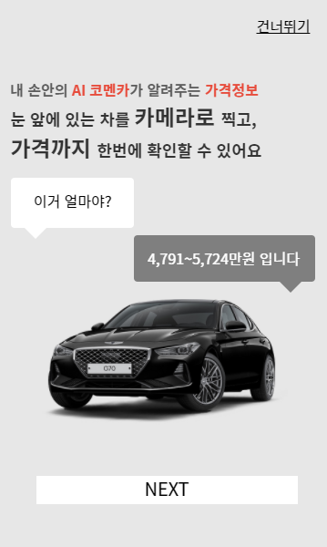

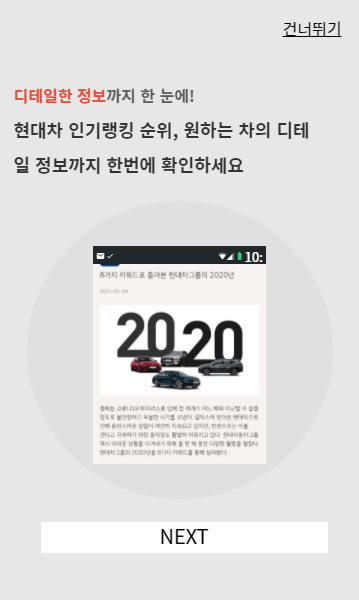

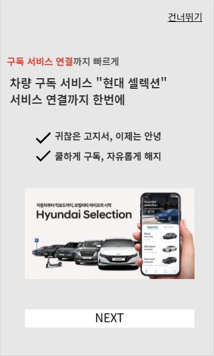

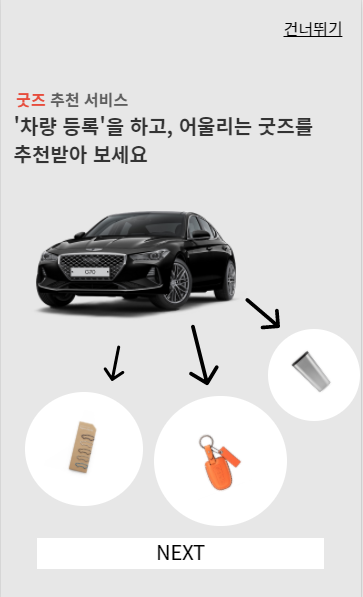

| 구분 | 항목                 | 내용                                                  |
| ---- | -------------------- | ----------------------------------------------------- |
| 1    | Komencar 설명 페이지 | komencar가 어떤 서비스를 제공하는지 설명하는 페이지   |
| 2    | NEXT 버튼            | 다음 설명으로 넘어가는 버튼                           |
| 3    | 건너뛰기             | 설명페이지를 건너뛰고 바로 메인페이지로 넘어가는 버튼 |

# 2.카메라 촬영 페이지

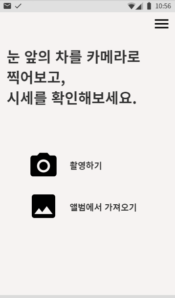

| 구분 | 항목              | 내용                                                      |
| ---- | ----------------- | --------------------------------------------------------- |
| 1    | 촬영하기 버튼     | 폰 카메라로 직접 자동차를 촬영하여 이미지를 가져오는 기능 |
| 2    | 앨범에서 가져오기 | 앨범에 접근하여 직접 이미지를 가져오는 기능               |
| 3    | 메뉴버튼          | 메뉴를 보여주는 버튼                                      |

# 3.AI 분석 결과 페이지

### 3-1) 로그인 안했을때

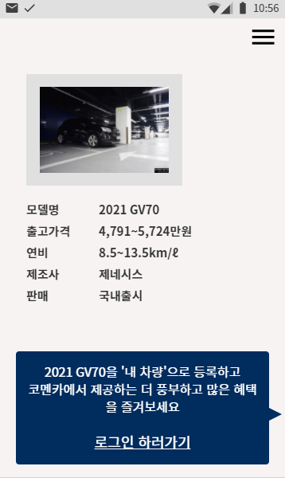

### 3-2) 로그인 했을때

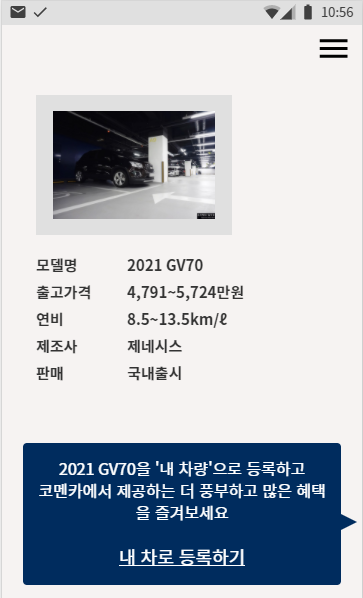

| 구분 | 항목            | 내용                                                         |
| ---- | --------------- | ------------------------------------------------------------ |
| 1    | 분석 결과       | 분석한 이미지와 함께 ai로 이미지를 분석한 결과 모델명,출고가격,연비,제조사,판매 등 정보를 알려줌 |
| 2    | 내차량등록 알림 | 분석한 차량을 내차로 등록할 수 있는 기능(로그인 한경우) / 로그인 하지 않은 경우 로그인페이지로 넘어감 |

# 4. 상단 메뉴탭 클릭했을때

### 4-1) 로그인 안한 상태

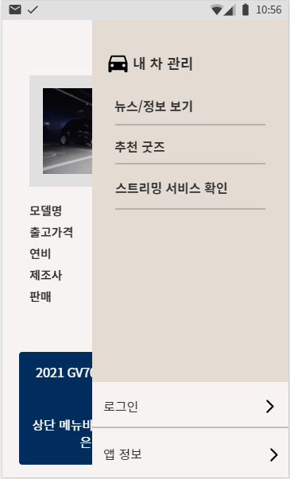

### 4-1-1)로그인 안하고, 메뉴 눌렀을때

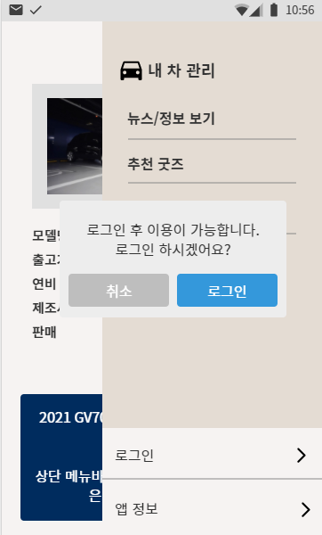

### 4-2) 로그인했을때

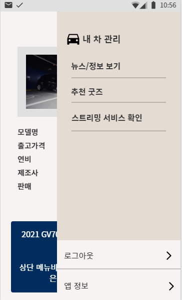

| 구분 | 항목        | 내용                                                         |
| ---- | ----------- | ------------------------------------------------------------ |
| 1    | 메뉴        | 뉴스/정보보기 & 추천 굿즈 & 스트리밍 서비스 확인 메뉴가 있고, 로그인/로그아웃과 앱정보를 알 수 있다 |
| 2    | 로그인 유무 | 로그인을 하지않은 상태에서는 메뉴를 눌렀을 때 로그인 팝업창이 뜬다 |
| 3    | 로그인버튼  | 로그인 했을 때는 로그아웃 버튼이, 로그인 하지 않았을 때는 로그인 버튼이 뜬다 |

# 5.로그인 페이지

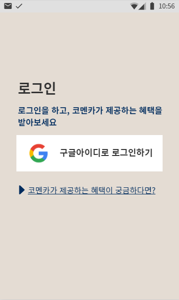

| 구분 | 항목                                      | 내용                                                |
| ---- | ----------------------------------------- | --------------------------------------------------- |
| 1    | 구글 로그인                               | 구글로 로그인을 간편하게 할 수 있다                 |
| 2    | 코멘카가 제공하는 혜택이 궁금하다면? 버튼 | 코멘카의 혜택을 설명해주는 어바웃 페이지로 이동한다 |

# 6. 로그인하고 메뉴 클릭했을때

- 로그인하고 메뉴탭 클릭하면, 차량으로 등록된 모든 차량 나옴 

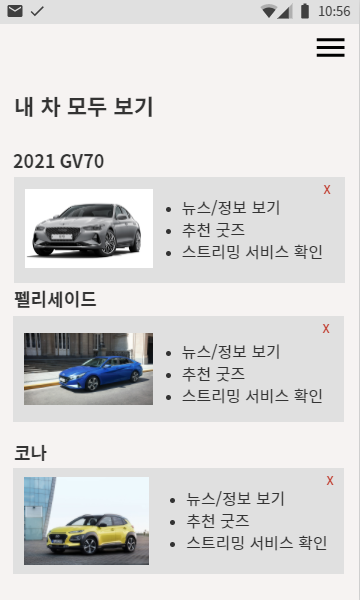

| 구분 | 항목         | 내용                                                         |
| ---- | ------------ | ------------------------------------------------------------ |
| 1    | 내차모두보기 | 내가 등록한 차량을 모두 볼 수 있다                           |
| 2    | 내차항목     | 차량의 모델명, 이미지를 보여주고 해당 차의 뉴스/정보, 추천굿즈, 스트리밍 서비스를 확인할 수 있다 |
| 3    | 내차삭제     | 내가 등록한 차를 삭제 할 수 있다                             |

# 7. 메뉴 탭 (1.뉴스/정보 보기)

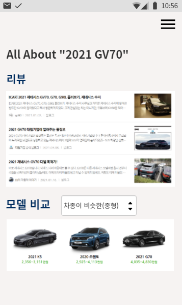

+ 의견 : 여기에 된다면, 댓글 반응 분석해서 텍스트마이닝 추가

| 구분 | 항목                | 내용                                                        |
| ---- | ------------------- | ----------------------------------------------------------- |
| 1    | 해당 모델의 리뷰    | 해당 모델의 리뷰를 알 수 있다                               |
| 2    | 모델비교            | 다른 차종과 비교해서 현재 모델이 어떤지 알 수 있다          |
| 3    | (의견)댓글반응 분석 | 텍스트마이닝으로 해당 모델의 분석을 텍스트마이닝으로 보여줌 |

# 8 .메뉴 탭 (2.추천 굿즈)

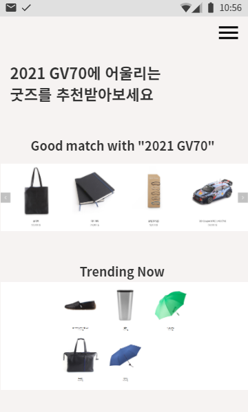

| 구분 | 항목     | 내용                                                         |
| ---- | -------- | ------------------------------------------------------------ |
| 1    | 굿즈추천 | 해당 모델에 어울리는 굿즈를 추천받음(차모형, 키링, 우산, 노트 등) |

# 9. 스트리밍 서비스

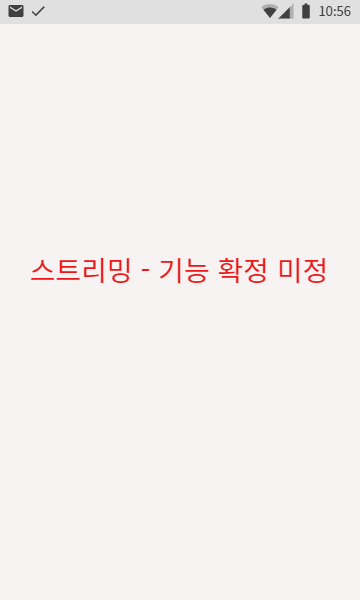