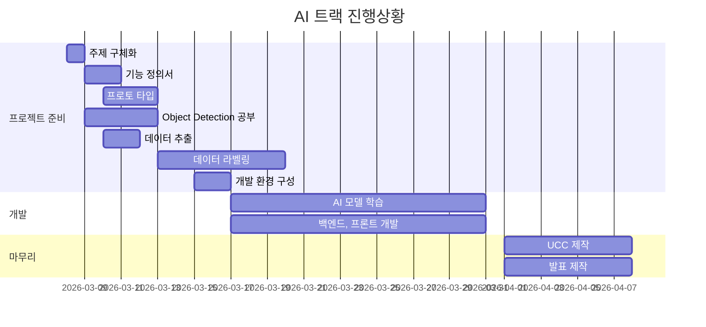
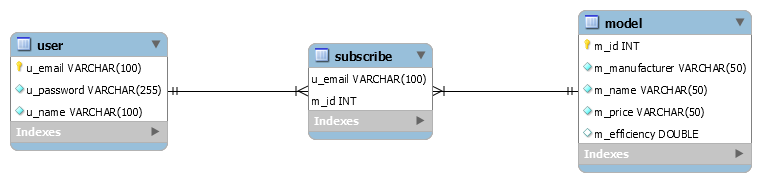

# 특화프로젝트 SUB-II

[TOC]

## 팀원 소개

| 이름   | 직책 | 역할       |
| ------ | ---- | ---------- |
| 배상웅 | 팀장 | 백엔드     |
| 고재석 | 팀원 | 백엔드     |
| 김채린 | 팀원 | 프론트엔드 |
| 박수아 | 팀원 | 프론트엔드 |
| 정혜림 | 팀원 | 프론트엔드 |

## 프로젝트 개요

- **프로젝트 기간** : 2021.03.02 ~ 2021.04.09
- 프로젝트명 : 코멘카(Komencar)

- 목표
  - Object-Detection을 이용한 AI 모델링 학습을 통해 이미지 캡셔닝 서비스를 개발한다.
  - 사용자가 촬영한 차량 이미지를 받아 해당 차량의 모델을 예측하고, 이에 대한 세부 정보를 제공한다.
    [ 학습할 차량은 현대 자동차의 5종(그랜저, 아반떼, 쏘나타, 코나, 팰리세이드)으로 제한한다. ]
  - 검색된 차량 정보에 맞는 부가 서비스(관련 뉴스, 리뷰 등)를 제공한다.

---

## 주요기능

1.  차량 모델 검색 서비스

- 차량의 사진을 찍어서 서버에 전송하면 모델 종류 및 상세 정보를 제공
- 차량 모델을 직접 검색하면 해당 차량의 상세 정보를 제공

2.  모델 정보 분석 서비스

- 검색한 차량의 상세 정보와 옵션별 차트 제공
- 차량 세대(ex. 1세대, 2세대)의 가장 최신 모델과 성능 비교 차트 제공
- 검색 차량과 비슷한 모델(가격대, 차체 크기로 구분)과 비교하여 분석한 정보 제공
- 검색 차량의 관련 뉴스 제공

---

## **제작 시** **사용된 기술**

- AI

  - Object-Detection (API 사용)
  - ssd_inception_v2_coco (오픈 모델)

- Back-end

  - SpringBoot, JPA, MariaDB, Docker

- Front-end
  - HTML, vue.js, TypeScript, CSS, SCSS

</a>
</a>
</a>

</a>
</a>

</a>
</a>

---

## 프로토타입 & 화면 정의서

**초기 프로토타입 문서**  
[komencar_prototype](https://lab.ssafy.com/s04-ai-image-sub3/s04p23b101/blob/master/Prototype/Komencar_%ED%94%84%EB%A1%9C%ED%86%A0%ED%83%80%EC%9E%85.md)

**어바웃 페이지**  

**이미지 검색 페이지 - 카메라**  

**이미지 검색 페이지 - 앨범**  

**코멘카 navi바 이동**  

**코멘카 반응형**  

**코멘카 전체 시연**  

---

## 개발문서

https://docs.google.com/spreadsheets/d/1N7dpt55lEjgBRNpb1RvTBGu16N35-yzskRAggzWsvnQ/edit#gid=0

---

## Gantt Chart

## ERD

---

## PROJECT RULES

[project-rules](https://lab.ssafy.com/s04-ai-image-sub3/s04p23b101/blob/master/project_rule.md)
