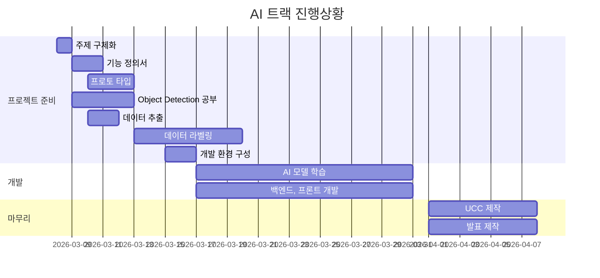

# 특화프로젝트 SUB-II

[TOC]

## 팀원 소개

| 이름   | 직책 | 역할       |
| ------ | ---- | ---------- |
| 배상웅 | 팀장 | 백엔드     |
| 고재석 | 팀원 | 백엔드     |
| 김채린 | 팀원 | 프론트엔드 |
| 박수아 | 팀원 | 프론트엔드 |
| 정혜림 | 팀원 | 프론트엔드 |

## 프로젝트 개요

- **프로젝트 기간** : 2021.03.02 ~ 2021.04.09
- 프로젝트명 : 코멘카(Komencar)

- 목표

## **제작 시** **사용된 기술**

---

## 주요기능

---

## 개발문서

https://docs.google.com/spreadsheets/d/1N7dpt55lEjgBRNpb1RvTBGu16N35-yzskRAggzWsvnQ/edit#gid=0

## Gantt Chart



## Git Rule

### branch

```bash
master -> develop -> feature/(BE,FE)-기능
```

### merge

```
Merge 하기 전 깃랩 Merge Request 이용.
Merge 후 Branch 삭제.
```

### commit

```bash
지라이슈번호 커밋내용
```

### gitflow workflow 순서

1. develop branch생성 후 develop branch를 default branch로 설정
2. 중앙 원격 저장소(origin)의 develop branch와 연결된 새로운 'develop' branch를 로컬 저장소에 연결

```bash
$ git checkout -b develop origin/develop
```

3. 새로운 기능 개발을 위해 FEATURE branch를 만든다

- 로컬 저장소에서 branch를 따고, 코드를 수정하고, 변경 내용을 커밋한다.
- 이때, ‘master’ branch에서 기능 개발을 위한 브랜치를 따는 것이 아니라, ‘develop’ branch에서 따야한다.

```bash
$ git checkout -b [branch name] develop
```

4. 커밋하기 전 최신상태를 업데이트한다

```bash
$ git pull origin develop
```

5. 로컬 저장소의 새로운 기능 브랜치를 중앙 원격 저장소(remote repository)에 푸시한다.

- 새로 만든 브랜치(feature/login branch)에 새로운 기능에 대한 내용을 커밋한다.
- 커밋을 완료했다면, 내가 작업한 내용을 포함한 브랜치(feature/login branch)를 중앙 원격 저장소에 올린다.

```bash
$ git commit -a -m "Write commit message"

# 위의 명령어는 아래의 두 명령어를 합한 것
$ git add . # 변경된 모든 파일을 스테이징 영역에 추가
$ git add [some-file] # 스테이징 영역에 some-file 추가
$ git commit -m "Write commit message" # local 작업폴더에 history 하나를 쌓는 것
```

```bash
$ git push origin [branch name]
```

6. pull request를 한다

- gitlab에서 create merge를 현재 브랜치에서 develop 브랜치로 pull request를 한다

7. 로컬저장소의 develop branch에 중앙원격저장소(origin)의 최신 내용을 가져온다

```bash
$ git checkout develop
$ git pull origin develop
```

8. 기능이 완성된 feature branch를 삭제한다.

```bash
$ git branch -d [기능브렌치]
```

9. 모든 기능 완성했을 때 배포하기

- develop branch에서 버전에 대한 기능이 모두 구현되었으면 develop branch에서 그 작업에 대한 release branch를 생성 후 이동

```bash
$ git checkout -b release-버전 develop
```

- 이렇게 release 브랜치를 만드는 순간부터 배포 사이클이 시작된다.

- release 브랜치에서는 배포를 위한 최종적인 버그 수정, 문서 추가 등 릴리스와 직접적으로 관련된 작업을 수행한다.

- 직접적으로 관련된 작업들을 제외하고는 release 브랜치에 새로운 기능을 추가로 병합(merge)하지 않는다.

- ‘release’ 브랜치에서 배포 가능한 상태가 되면(배포 준비가 완료되면),

  - 배포 가능한 상태: 새로운 기능을 포함한 상태로 모든 기능이 정상적으로 동작 하는 상태

  1. 팀이 풀 리퀘스트를 통한 코드 리뷰하는 방식을 사용한다면 release 브랜치를 그대로 중앙 원격 저장소에 올린 후 다른 팀원들의 확인을 거쳐 ‘master’와 ‘develop’ branch에 병합한다.
     1. ‘master’ 브랜치에 병합한다. (이때, 병합한 커밋에 Release 버전 태그를 부여!)
     2. 배포를 준비하는 동안 release 브랜치가 변경되었을 수 있으므로 배포 완료 후 ‘develop’ 브랜치에도 병합한다.
  2. 작업했던 release 브랜치는 삭제한다. 이때, 다음 번 배포(Release)를 위한 개발 작업은 ‘develop’ 브랜치에서 계속 진행해 나간다.

```bash
# pull request 이용하지 않는 경우(우린 이용함!)
/* release 브랜치에서 배포 가능한 상태가 되면 */
// 'master' 브랜치로 이동한다.
$ git checkout master
// 'master' 브랜치에 release-1.2 브랜치 내용을 병합(merge)한다.
# --no-ff 옵션: 위의 추가 설명 참고
$ git merge --no-ff release-1.2
// 병합한 커밋에 Release 버전 태그를 부여한다.
$ git tag -a 1.2
// 'master' 브랜치를 중앙 원격 저장소에 올린다.
$ git push origin master

/* 'release' 브랜치의 변경 사항을 'develop' 브랜치에도 적용 */
// 'develop' 브랜치로 이동한다.
$ git checkout develop
// 'develop' 브랜치에 release-1.2 브랜치 내용을 병합(merge)한다.
$ git merge --no-ff release-1.2
// 'develop' 브랜치를 중앙 원격 저장소에 올린다.
$ git push origin develop

// -d 옵션: release-1.2에 해당하는 브랜치를 삭제한다.
$ git branch -d release-1.2
```

10. 버그 수정하기

- 배포한 버전에 긴급하게 수정을 해야 할 필요가 있을 경우, ‘master’ 브랜치에서 직접 브랜치(‘hotfix’ 브랜치)를 만들어 필요한 부분만을 수정한 후 다시 ‘master’브랜치에 병합하여 이를 배포해야 한다.

```bash
// release 브랜치(hotfix-1.2.1)를 'master' 브랜치(유일!)에서 분기
$ git checkout -b hotfix-1.2.1 master

/* ~ 문제가 되는 부분만을 빠르게 수정 ~ */
git add .
git commit -m'커밋메세지'
git push origin hotfix-1.2.1
```

- 고친 hotfix 브랜치를 master에 pull request한다

## Frontend Code Style Guide

### 컴포넌트/ 인스턴스 옵션 순서

1. **템플릿 의존성(Template Dependencies)** (템플릿에 이용되는 요소들을 지정하는 옵션)
   - `components`
2. **인터페이스(Interface)** (컴포넌트의 인터페이스를 지정하는 옵션)
   - `props`/`propsData`
3. **지역 상태(Local State)** (반응적인 지역 속성들을 설정하는 옵션)
   - `data`
   - `computed`
4. **이벤트(Events)** (반응적인 이벤트에 의해 실행되는 콜백을 지정하는 옵션)
   - `watch`
   - 라이프사이클 이벤트 (호출 순서대로 정렬)
     - `beforeCreate`
     - `created`
     - `beforeMount`
     - `mounted`
     - `beforeUpdate`
     - `updated`
     - `activated`
     - `deactivated`
     - `beforeDestroy`
     - `destroyed`
5. **비반응적 속성(Non-Reactive Properties)** (시스템의 반응성과 관계 없는 인스턴스 속성을 지정하는 옵션)
   - `methods`


### View와 Components 폴더 

1. View폴더에는 기능별 컴포넌트들을 담을 메인 페이지만 넣기
   - 싱글페이지 앞에는 `The`붙이기

```sh
views/
|- user/(회원관리페이지)
	|- SignupPage.vue
	|- LoginPage.vue
|- carSearch/(메인페이지)
	|- CarSearchPage.vue
	|- CarSearchDetailPage.vue
|- TheAbout.vue
|- TheMenu.vue
```

2. Components 폴더안에는 해당 기능 페이지의 컴포넌트들 모두 적기
   - 한 페이지 안에 들어가는 기능은 `prefix(접두어)`를 같게 만들어라(또는 접두어 폴더안에 담아라) 

```sh
Components/
|- common/(공통적으로 쓰일 컴포넌트들을 담는 폴더)
|- user/(회원관리기능 폴더)
	|- SignupForm.vue
	|- LoginForm.vue
|- carSearch/(자동차 찾기 관련 폴더)
	|- CarImageCamera.vue(자동차 카메라로 이미지 업로드)
	|- CarImageGallery.vue(자동차 앨범에서 이미지 업로드)
```


###  컴포넌트 이름

1. 파스칼 케이스로 이름 설정한다. ex) `TodoItem`
2. 첫 글자 대문자, 단어가 바뀌면 대문자


### 컴포넌트 import

```html
<!-- In single-file components, string templates, and JSX -->
<MyComponent/>
```


### props 규정

- `HTML`과 `prop`는 둘다 파스칼케이스로 이름을 지정한다

- default

```js
props: {
    items: {
      type: any,
      required: true
    }
  },
```

- 예시

```js
props: {
    items: {
      type: Array as PropType<NewsItem[]>,
      required: true
    }
},
```


### 다중 속성 엘리먼트

```html


<MyComponent
  foo="a"
  bar="b"
  baz="c"
/>
```


### computed

- 가독성 좋게! 단순한 계산된 값은 한줄로 표현


### methods

- 동사형, 기능을 명확하게 알 수 있도록 변수명을 정함


### css/scss 

- `index.scss` 파일로 `index.css`로 변환해서 관리

#### 파일명

```sh
|- sass/
	|- index.scss
	|- abstracts/
		|- _variables.scss
		|- _mixins.scss(속성은 같은데 바꿀 값이 다를때 재사용할 수 있게 만듦)
	|- base/(CSS의 기본적이고 기능적인 설정들)
		|- _base.scss (기본 설정)
		|- _animations.scss(animation)
		|- _typo.scss(글자 text style)
		|- _utilities.scss(자주 쓰는 margin 등을 따로 설정)
	|- components/(버튼이나 메뉴같은 마우스 컨트롤 요소들,컴포넌트 별, element별)
		|- _container.scss
	|- layout/(html 요소별 나눔)
		|- _header.scss
		|- footer.scss
```


#### class명

- 위에 큰 부모 밑에 아래 요소를 `__`(속성), `--`(수정)에 사용

- 공통적으로 사용될 수 있는 css요소들은 `components`에 해당 요소 파일을 만들어 적고, 주석으로 설명 적기

- 블록(block), 요소(element), 상태(modifier)로 구분하여 클래스 작성하며 엄격한 네이밍 규칙을 가진다.
- block : 재사용 가능한 영역(header, footer, navigation…), 하나의 단어를 사용하되 길어질 경우 (-)를 사용

```css
.header { ... }
.block { ... }
```

- element : 블록의 내부 구성을 표현, 두개의 underscores( _ )로 표기

```css
.header { ... }
.header__link { ... }
.header__tap { ... }
.header__tap__item { ... }
```

- modifier : 요소의 상태를 표현, 두개의 hyphen(-)로 표기

```css
.header--hide { ... }
.header__tap--big { ... }
.header__tap--big { ... }
```

코드를 직관적으로 파악할수 있지만 이름이 길고 복잡해 질수 있다.


## ERD


## 프로젝트 설정

### Frontend

- `settings.json`

```json
{

  "editor.quickSuggestions": {
    "strings": true
  },
  "editor.suggest.insertMode": "replace",
  "editor.codeActionsOnSave": {
    "source.fixAll.eslint": true
  },
  "eslint.alwaysShowStatus": true,
  "eslint.workingDirectories": [
    {
      "mode": "auto"
    }
  ],
  "eslint.validate": [
    "javascript",
    "typescript"
  ],
  "liveSassCompile.settings.formats": [
    {
      "format": "expanded",
      "extensionName": ".css",
      "savePath": "~/../css"
    },
  ],
  "liveSassCompile.settings.generateMap":false,
  "liveSassCompile.settings.excludeList": [
    "**/node_modules/**",
    ".vscode/**"
  ],
  "liveSassCompile.settings.autoprefix": [
    "> 1%",
    "last 2 versions"
  ]
}

```

