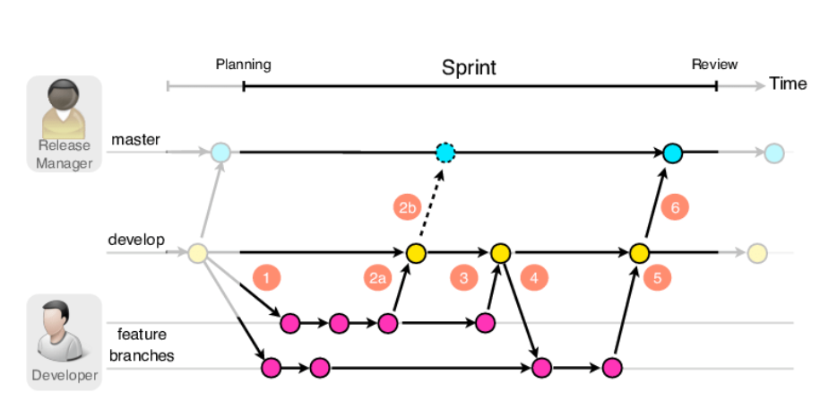
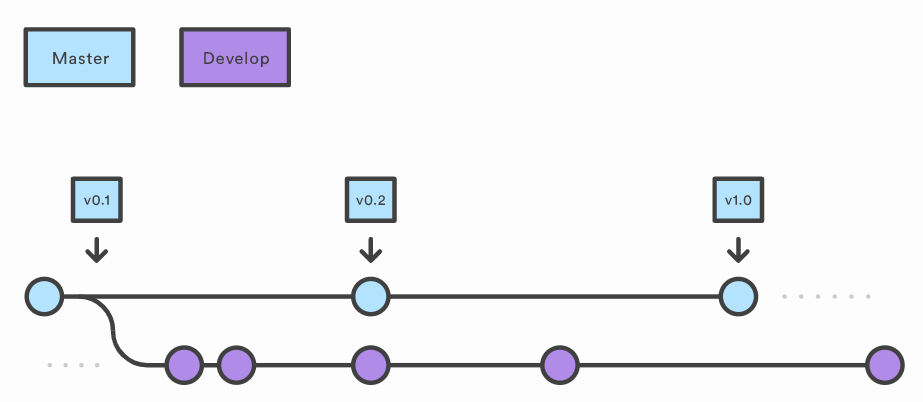
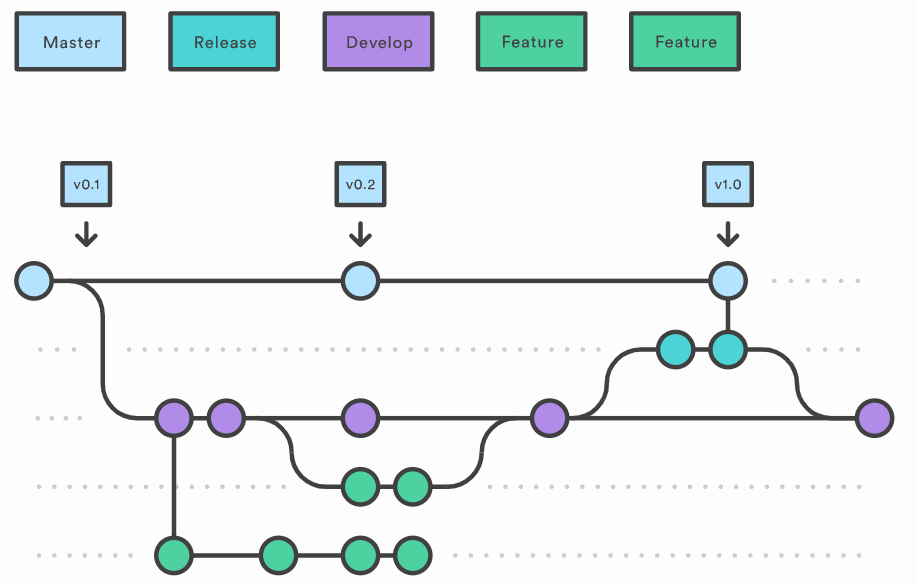
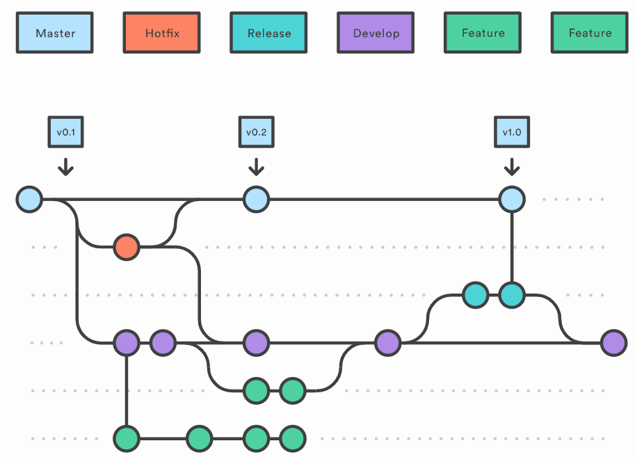
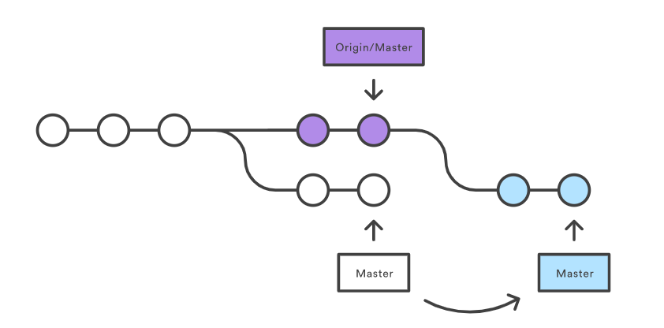
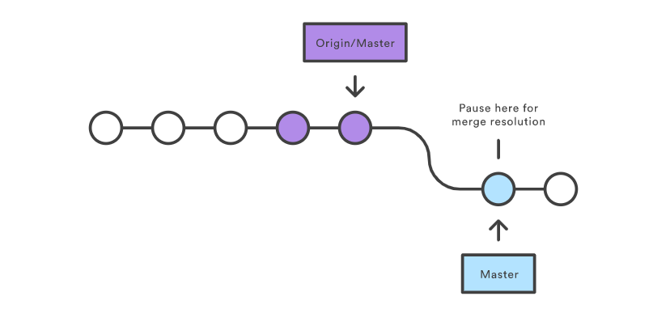

# Gitflow Workflow

>[Git을 이용한 협업 워크플로우 4가지](https://blog.appkr.dev/learn-n-think/comparing-workflows/#3-gitflow-workflow)
>
>1. [Centralized Workflow](https://blog.appkr.dev/learn-n-think/comparing-workflows/#1-centralized-workflow)
>2. [Feature Branch Workflow](https://blog.appkr.dev/learn-n-think/comparing-workflows/#2-feature-branch-workflow)
>3. [Gitflow Workflow](https://blog.appkr.dev/learn-n-think/comparing-workflows/#3-gitflow-workflow)
>4. [Forking Workflow](https://blog.appkr.dev/learn-n-think/comparing-workflows/#4-forking-workflow)
>
>Gitflow Workflow는 코드 릴리스를 중심으로 좀 더 엄격한 브랜칭 모델을 제시
>
>Feature Branch Workflow보다 복잡하긴하지만, 대형 프로젝트에도 적용할 수 있는 강건한 작업 절차

## 순서

1. develop branch생성 후 develop branch를 default branch로 설정
2. 중앙 원격 저장소(origin)의 develop branch와 연결된 새로운 'develop' branch를 로컬 저장소에 연결

```bash
$ git checkout -b develop origin/develop
```


3. 새로운 기능 개발을 위해 FEATURE branch를 만든다

로컬 저장소에서 branch를 따고, 코드를 수정하고, 변경 내용을 커밋한다.
이때, ‘master’ branch에서 기능 개발을 위한 브랜치를 따는 것이 아니라, ‘develop’ branch에서 따야한다.

```bash
$ git checkout -b [branch name] develop
```


4. 커밋하기 전 최신상태를 업데이트한다

```bash
$ git pull origin develop
```

5. 로컬 저장소의 새로운 기능 브랜치를 중앙 원격 저장소(remote repository)에 푸시한다.

- 새로 만든 브랜치(feature/login branch)에 새로운 기능에 대한 내용을 커밋한다.
- 커밋을 완료했다면, 내가 작업한 내용을 포함한 브랜치(feature/login branch)를 중앙 원격 저장소에 올린다.

```bash
$ git commit -a -m "Write commit message"

# 위의 명령어는 아래의 두 명령어를 합한 것
$ git add . # 변경된 모든 파일을 스테이징 영역에 추가
$ git add [some-file] # 스테이징 영역에 some-file 추가
$ git commit -m "Write commit message" # local 작업폴더에 history 하나를 쌓는 것
```

```bash
$ git push origin [branch name]
```

6. pull request를 한다

- gitlab에서 create merge를 현재 브랜치에서 develop 브랜치로 pull request를 한다

7. 로컬저장소의 develop branch에 중앙원격저장소(origin)의 최신 내용을 가져온다

```bash
$ git checkout develop
$ git pull origin develop
```

8. 기능이 완성된 feature branch를 삭제한다.

```bash
$ git branch -d [기능브렌치]
```

9. 모든 기능 완성했을 때 배포하기

- develop branch에서 버전에 대한 기능이 모두 구현되었으면 develop branch에서 그 작업에 대한 release branch를 생성 후 이동

```bash
$ git checkout -b release-버전 develop
```

- 이렇게 release 브랜치를 만드는 순간부터 배포 사이클이 시작된다.

- release 브랜치에서는 배포를 위한 최종적인 버그 수정, 문서 추가 등 릴리스와 직접적으로 관련된 작업을 수행한다.

- 직접적으로 관련된 작업들을 제외하고는 release 브랜치에 새로운 기능을 추가로 병합(merge)하지 않는다.

- ‘release’ 브랜치에서 배포 가능한 상태가 되면(배포 준비가 완료되면),

  - 배포 가능한 상태: 새로운 기능을 포함한 상태로 모든 기능이 정상적으로 동작 하는 상태

  1. 팀이 풀 리퀘스트를 통한 코드 리뷰하는 방식을 사용한다면 release 브랜치를 그대로 중앙 원격 저장소에 올린 후 다른 팀원들의 확인을 거쳐 ‘master’와 ‘develop’ branch에 병합한다.
     1. ‘master’ 브랜치에 병합한다. (이때, 병합한 커밋에 Release 버전 태그를 부여!)
     2. 배포를 준비하는 동안 release 브랜치가 변경되었을 수 있으므로 배포 완료 후 ‘develop’ 브랜치에도 병합한다.
  2. 작업했던 release 브랜치는 삭제한다. 이때, 다음 번 배포(Release)를 위한 개발 작업은 ‘develop’ 브랜치에서 계속 진행해 나간다.

``` bash
# pull request 이용하지 않는 경우(우린 이용함!)
/* release 브랜치에서 배포 가능한 상태가 되면 */
// 'master' 브랜치로 이동한다.
$ git checkout master
// 'master' 브랜치에 release-1.2 브랜치 내용을 병합(merge)한다.
# --no-ff 옵션: 위의 추가 설명 참고
$ git merge --no-ff release-1.2
// 병합한 커밋에 Release 버전 태그를 부여한다.
$ git tag -a 1.2
// 'master' 브랜치를 중앙 원격 저장소에 올린다.
$ git push origin master

/* 'release' 브랜치의 변경 사항을 'develop' 브랜치에도 적용 */
// 'develop' 브랜치로 이동한다.
$ git checkout develop
// 'develop' 브랜치에 release-1.2 브랜치 내용을 병합(merge)한다.
$ git merge --no-ff release-1.2
// 'develop' 브랜치를 중앙 원격 저장소에 올린다.
$ git push origin develop

// -d 옵션: release-1.2에 해당하는 브랜치를 삭제한다.
$ git branch -d release-1.2
```

10. 버그 수정하기 

- 배포한 버전에 긴급하게 수정을 해야 할 필요가 있을 경우, ‘master’ 브랜치에서 직접 브랜치(‘hotfix’ 브랜치)를 만들어 필요한 부분만을 수정한 후 다시 ‘master’브랜치에 병합하여 이를 배포해야 한다.

```bash
// release 브랜치(hotfix-1.2.1)를 'master' 브랜치(유일!)에서 분기
$ git checkout -b hotfix-1.2.1 master

/* ~ 문제가 되는 부분만을 빠르게 수정 ~ */
git add .
git commit -m'커밋메세지'
git push origin hotfix-1.2.1
```

- 고친 hotfix 브랜치를 master에 pull request한다


## [설명]



### 1. 메인브랜치(master, develop branch)

> 메인 브랜치는 master 브랜치와 develop 브랜치 두 종류를 말합니다
>
> master 브랜치는 배포 가능한 상태만을 관리하는 브랜치를 말하며, develop브랜치는 다음에 배포할 것을 개발하는 브랜치입니다. 즉 develop 브랜치는 통합 브랜치의 역할을 하며, 평소에는 이 브랜치를 기반으로 개발을 진행합니다.

### develop branch를 default branch로 설정

> 'develop' branch를 default branch로 설정하는 이유?
> 평소에는 ‘develop’ branch를 기반으로 개발을 진행하기 때문에
> `$ git push origin some-feature`(내 로컬 저장소의 some-feature branch를 중앙 원격 저장소로 올리는 명령)를 한 후, GitLab 페이지에서 해당 some-feature branch에 대해 merge를 할 때 중앙 원격 저장소의 ‘master’ branch가 아닌 default로 설정되어 있는 ‘develop’에 병합하도록 설정하는 것이다.

### 2. 보조 브랜치(Feature branch)

> 
>
> master 브랜치에서 develop 브랜치를 만들었고, develop 브랜치에서 다시 feature 브랜치를 나눠 작업을 하고 있는 것을 그림을 통해 알 수 있습니다. **feature브랜치는 기능을 개발하는 브랜치**입니다. **develop 브랜치에는 기존에 잘 작동하는 개발코드**가 담겨있으며, **보조 브랜치는 새로 변경될 개발코드를 분리하고 각각 보존하는 역할**을 합니다. 즉 보조 브랜치는 기능을 다 완성할 때까지 유지하고, 다 완성되면 develop 브랜치로 merge 하고 결과가 좋지 못하면 버리는 방향을 취합니다. 보조 브랜치는 보통 개발자 저장소에만 있는 브랜치고, origin에는 push하지 않습니다.
>
> 만약 feature 브랜치를 사용한다면, feature/#이슈번호 와 같은 형태로 브랜치를 관리합니다. 

#### Feature 브런치

- 브런치 나오는 곳 : `develop`
- 브런치가 들어가는 곳 : `develop`
- 이름 지정 : `master`, `develop`, `release-*`, `hotfix-*`를 제외한 어떤 것이든 가능.
- feature 브랜치를 생성할 때는 develop 브랜치에서부터 생성합니다. 그리고 꼭 브랜치를 생성하기 전에 develop 브랜치를 pull 받아야합니다. feature 브랜치는 아래와 같이 생성합니다.
- 한 브랜치에서 파생되는 브랜치 만들기 `git checkout -b {새로운 로컬 Branch 이름} {원격 저장소 별칭}/{원격 Branch 이름}`

```bash
git checkout -b 브랜치 이름 (해당 브랜치가 존재하지 않는다면 브랜치를 새로 만들면서 바로 그 브랜치로 이동합니다.)
ex) git checkout -b feature/#1(기능 or 이슈번호) origin/develop

git checkout 브랜치이름 (존재하는 브랜치가 있다면 그 브랜치로 이동합니다.)
ex) git checkout feature/#1(기능 or 이슈번호) develop
```


### pull request 보내는 방법

Pull Request를 보내는 이유는 Merge 하기 전에 코드 리뷰를 하기 위해서입니다. 만약 feature/#1과 같은 기능 브랜치가 완성됐다면, develop 브랜치에 Pull Request를 보내야 합니다. 그 방법에 대해 알아보겠습니다. 

```bash
git add .
git commit -m "커밋 컨벤션 메시지" (ex: Feat: 추가 로그인 API 로직 구현)
git push origin 브랜치 이름 (ex: feature/#1)
```

위와 같이 브랜치에 커밋을 한 후에 Repository를 보면 pull request가 초록색 버튼으로 뜹니다.

여기서 중요하게 봐야 할 점은 위에 머지하는 브랜치와 머지되는 브랜치입니다. 

**feature/#1브랜치를 develop 브랜치로 Merge해야됩니다**


### 변동사항 pull 받기

develop의변동사항을 pull 받기

```bash
git pull oigin develop
```


### 기능개발 완료시 master로 pull하기

```bash
git checkout master
git pull origin develop
```


------

### 1. 작동 원리

Gitflow Workflow도 팀 구성원간의 협업을 위한 창구로 중앙 저장소를 사용한다. 또 다른 워크플로우와 마찬가지로 로컬 브랜치에서 작업하고 중앙 저장소에 푸시한다. 단지 브랜치의 구조만 다를 뿐이다.

### 2. 이력을 기록하는 브랜치



`master` 브랜치 뿐만아니라, 이 워크플로우에서는 두 개의 다른 브랜치도 변경 이력을 유지하기 위해 사용한다. `master` 브랜치는 릴리스 이력을 관리하기 위해 사용하고, `develop` 브랜치는 기능 개발을 위한 브랜치들을 병합하기 위해 사용한다. 그래서, `master` 브랜치는 릴리스 태그를 매기기에 아주 적합하다.

이 워크플로우의 모든 작업 절차들은 `master`와 `develop` 두 개의 브랜치를 대상으로 한다.

### 3. 기능 브랜치


새로운 기능은 각각의 브랜치에서 개발하고 백업 및 협업을 위해서 중앙 저장소에 푸시한다. 그런데, `master` 브랜치에서 기능 개발을 위한 브랜치를 따는 것이 아니라, `develop` 브랜치에서 딴다. 그리고, 기능 개발이 끝나면 다시 `develop` 브랜치에 작업 내용을 병합한다. 바꾸어 말하면, 기능 개발을 위한 브랜치는 `master` 브랜치와는 어떤 상호 작용도 하지 않는다.

Feature Branch Workflow라면 `develop` 브랜치에 개발한 기능을 병합하는 것으로 모든 과정이 끝날테지만, Gitflow Workflow는 아직 할 일이 더 남아 있다.

### 4. 릴리스 브랜치



`develop` 브랜치에 릴리스를 할 수 있는 수준만큼 기능이 모이면(또는 정해진 릴리스 일정이 되면), `develop` 브랜치를 기준으로 릴리스를 위한 브랜치를 딴다. 이 브랜치를 만드는 순간부터 릴리스 사이클이 시작되고, 버그 수정, 문서 추가 등 릴리스와 직접적으로 관련된 작업들을 제외하고는 이 브랜치에 새로운 기능을 추가 병합하지 않는다. 릴리스 준비가 완료되면 `master` 브랜치에 병합하고 버전 태그를 부여한다. 그리고, 릴리스를 준비하는 동안 `develop` 브랜치가 변경되었을 수 있으므로 `develop` 브랜치에도 병합한다.

릴리스를 위한 전용 브랜치를 사용함으로써 한 팀이 릴리스를 준비하는 동안 다른 팀은 다음 릴리스를 위한 기능 개발을 계속할 수 있다. 즉, 딱딱 끊어지는 개발 단계를 정의하기에 아주 좋다. 예를 들어, 이번 주에 버전 4.0 릴리스를 목표로한다라고 팀 구성원들과 쉽게 소통하고 합의할 수 있다는 말이다.

릴리스 브랜치는 `release-*` 또는 `release/*`처럼 이름 짓는 것이 일반적인 관례다.

### 5. 유지 보수를 위한 브랜치



운영 환경에 릴리스한 후 발견된 긴급 패치는 `hotfix` 브랜치를 이용한다. `hotfix` 브랜치만 `master`에서 바로 딸 수 있다. 패치가 준비되면 `master`와 `develop` 브랜치 양쪽에 병합하고, 새로운 버전 이름으로 태그를 매겨야 한다.

버그 수정만을 위한 브랜치를 따로 만들었기때문에, 다음 릴리스를 위해 개발하던 작업 내용에 전혀 영향을 주지 않는다. `hotfix` 브랜치는 `master` 브랜치를 부모로 하는 임시 브랜치라고 생각하면 된다.

### 예시

#### 0. 중앙 저장소는 만듦

#### 1. develop 브랜치 만들기

먼저 할 일은 `master` 브랜치를 기준으로 `develop` 브랜치를 만드는 것이다. 팀 구성원 중 한 명이 자신의 로컬 저장소에 빈 `develop` 브랜치를 만들고 중앙 저장소로 푸시하면 된다.

```bash
$ git branch develop
$ git push -u origin develop
```

`master` 브랜치는 축약된 프로젝트 이력만 담고 있는 반면, 이 개발 브랜치는 모든 개발 이력을 다 담을 것이다. 이제 팀 구성원들은 중앙 저장소를 복제하고, 중앙 저장소와 연결된 개발 브랜치를 만들어야 한다.

```bash
$ git clone [중앙저장소url]
$ git checkout -b develop origin/develop
```

이제 팀 구성원 모두가 이 워크플로우를 적용하기 위한 준비가 되었다고 가정하자.

#### 2. 철이와 미애의 기능개발

이 사례에서는 철이와 미애가 각자 맡은 기능을 개발할 기능 개발 브랜치를 만들고 서로 다른 기능을 개발한다고 가정한다. 다시 한 번 언급하지만, `master`를 베이스로 하지 않고, `develop` 브랜치를 기준으로 기능 개발 브랜치를 따야 한다.

```bash
$ git checkout -b some-feature develop
```

항상 하던대로 개발하고 변경 내용을 커밋한다.

```bash
$ git status
$ git add <some-file>
$ git commit
```

#### 3. 미애의 작업 완료 처리

몇 번의 커밋 끝에, 미애는 맡은 기능 개발을 완료했다. 만약에 팀이 풀 리퀘스트를 하기로 약속했다면, 미애는 자신의 기능 브랜치를 `develop` 브랜치에 병합해 달라고 풀 리퀘스트를 보낼 수 있다. 풀 리퀘스트를 이용하지 않기로 했다면 다음과 같이 직접 `develop` 브랜치에 병합하고 중앙 저장소에 푸시하면 된다.

```bash
# 풀리퀘스트 이용하기로 했을 때
$ git push -u origin develop

# 풀리퀘스트 이용하지 않기로 했을 때
$ git pull origin develop
$ git checkout develop
$ git merge some-feature
$ git push
$ git branch -d some-feature
```

기능 브랜치를 병합하기 전에 반드시 로컬 `develop` 브랜치에 중앙 저장소의 변경 내용을 반영해서 최신 상태로 만들어야 한다. `master`에 직접 병합하지 않도록 주의해야 한다. 병합할 때 충돌이 발생하면 아래와 같이 해결한다.

> ##### (참고) 충돌해결
>
> 철이가 푸시한 후 미애가 로컬 커밋을 푸시하려하면 어떤 일이 벌어질지 들여다 보자.
>
> ```bash
> $ git push origin master
> ```
>
> 미애의 커밋 이력은 중앙 저장소의 최신 커밋 이력을 포함하고 있지 않아(diverge), 미애의 푸시를 받아 주지 않는다. 이는 중앙 저장소의 커밋 이력을 보호하기 위한 장치다.
>
> ```bash
> # error: failed to push some refs to '/path/to/repo.git'
> # hint: Updates were rejected because the tip of your current branch is behind
> # hint: its remote counterpart. Merge the remote changes (e.g. 'git pull')
> # hint: before pushing again.
> # hint: See the 'Note about fast-forwards' in 'git push --help' for details.
> ```
>
> 미애는 철이의 커밋 이력을 로컬로 받아온 후, 자신의 로컬 커밋 이력과 통합한 후, 다시 푸시해야 한다.
>
> ##### 리베이스
>
> 미애는 `git pull` 명령으로 중앙 저장소의 변경 이력을 로컬 저장소로 내려 받는다. 이 명령은 중앙 저장소의 최신 이력을 내려 받는 동작과 이를 로컬 이력과 합치는 동작을 한 번에 한다.
>
> ```bash
> $ git pull --rebase origin master
> ```
>
> `--rebase` 옵션을 주면 중앙 저장소의 커밋 이력을 미애의 커밋 이력 앞에 끼워 넣는다.
>
> 
>
> `--rebase` 옵션 없이 쓸 수도 있지만, 불필요한 병합 커밋을 한 번 더해야 하는 번거로움이 있으므로 `--rebase` 옵션을 쓰는 것이 좋다.
>
> ##### 리베이스 충돌 해결
>
> 리베이스는 미애의 로컬 커밋을 새로 내려 받은 `master` 브랜치에 하나 하나 대입하고 대조해 가면서 커밋 이력을 재배열한다. 이런 동작 특성때문에 커밋 이력도 깔끔하게 유지할 수 있을 뿐만아니라, 경우에 따라 버그를 발견하기도 한다.
>
> 철이와 미애가 서로 다른 기능을 개발했다면, 리베이스 과정에 충돌이 발생할 가능성은 거의 없다. 어쨌든 리베이스 과정에 충돌이 발생하면, Git은 현재 커밋에서 리베이스를 멈추고 다음과 같은 메시지를 뿜어 낸다.
>
> ```bash
> # CONFLICT (content): Merge conflict in <some-file>
> ```
>
> 
>
> 이 사례에서 미애는 `git status` 명령으로, *Unmerged paths:* 부분에서 충돌이 발생한 파일을 찾을 수 있다.
>
> ```bash
> $ git status
> # Unmerged paths:
> # (use "git reset HEAD <some-file>..." to unstage)
> # (use "git add/rm <some-file>..." as appropriate to mark resolution)
> #
> # both modified: <some-file>
> ```
>
> 이제 `some-file`을 열어 충돌을 해결하고, 스테이징 영역에 변경된 파일을 추가한 후, 리베이스를 계속 하면 된다.
>
> ```bash
> $ git add <some-file>
> $ git rebase --continue
> ```
>
> 리베이스는 다음 커밋으로 넘어가고, 더 이상 충돌이 없다면 리베이스는 성공적으로 끝난다.
>
> 리베이스 중에 뭔가 잘못되었다면, 다음 명령으로 `git pull --rebase` 명령을 내리기 이전 상태로 되돌릴 수 있다.
>
> ```bash
> $ git rebase --abort
> ```
>
> 중앙 저장소의 커밋 이력과 로컬 커밋 이력을 모두 합쳤으므로, 이제 중앙 저장소에 올리기만 하면 된다.
>
> ```bash
> $ git push origin master
> ```


#### 4. 미애의 릴리스 준비

철이가 여전히 기능 개발에 몰두하고 있는 와중에, 미애는 첫 공식 릴리스를 준비하고 있다. 기능 개발과 마찬가지로 릴리스 과정을 캡슐화할 새로운 브랜치를 만들어야 한다. 이 과정에서 버전 번호를 부여한다.

```bash
$ git checkout -b release-0.1 develop
```

이 브랜치는 최종 테스트를 하거나, 문서를 수정하는 등 릴리스와 관련된 여러 가지 작업들을 처리하기 위한 격리 공간이다. 미애가 이 브랜치를 만든 이후에 `develop` 브랜치에 병합된 기능은 릴리스 대상에서 제외된다. 이번에 포함되지 않은 기능들은 다음 릴리스에 포함된다.

#### 5. 미애의 릴리스 완료

릴리스 준비가 끝나면, 릴리스 브랜치를 `master`와 `develop` 브랜치에 병합하고, 릴리스 브랜치는 삭제한다. `develop` 브랜치에도 병합하는 이유는 릴리스를 준비하면서 개발 중인 다른 기능에 영향을 줄 수 있는 작업을 했을 수도 있기 때문이다. 미애의 팀이 코드 리뷰를 하는 규칙을 가지고 있다면, 병합을 요청하는 풀 리퀘스트를 보낼 수도 있다.

```bash
$ git checkout master
$ git merge release-0.1
$ git push
$ git checkout develop
$ git merge release-0.1
$ git push
$ git branch -d release-0.1
```

릴리스 브랜치는 기능 개발(`develop`)과 프로젝트의 공식 릴리스 사이의 가교 역할을 한다. `master` 브랜치에 병합할 때는 태그를 부여하는 것이 나중을 위해서 여러 모로 편리하다.

```bash
$ git tag -a 0.1 -m "Initial public release" master
$ git push --tags
```

Git은 저장소에 어떤 이벤트가 발생할 때 미리 짜 놓은 스크립트를 자동으로 실행할 수 있는 훅(hook) 기능을 가지고 있다. 중앙 저장소의 `master` 브랜치에 푸시하거나 태그를 푸시할 때, 자동으로 공개 릴리스를 빌드하는 훅을 거는 등의 자동화도 가능하다.

#### 6. 버그 신고

릴리스를 배포한 후에, 미애는 철이와 함께 다음 릴리스를 준비하기 위해 일상으로 돌아갔다. 그런데 사용자가 현재 릴리스에 버그가 있다고 보고해왔다. 버그를 해결 하기 위해 미애(또는 철이)는 작업하던 기능 개발을 잠시 미뤄두고, `master` 브랜치를 기준으로 유지 보수 브랜치를 만들고, 버그를 수정하고 커밋한다. 버그 수정이 끝나면 `master` 브랜치에 바로 병합한다.

```bash
$ git checkout -b issue-#001 master
# Fix the bug
$ git checkout master
$ git merge issue-#001
$ git push
```

릴리스 브랜치와 마찬가지로, 유지 보수 브랜치에서의 변경 사항은 개발 중인 기능에도 반영되어야 하므로 `develop` 브랜치에도 병합해야 한다. 병합이 끝나면 유지 보수 브랜치는 삭제해도 좋다.

```bash
$ git checkout develop
$ git merge issue-#001
$ git push
$ git branch -d issue-#001
```